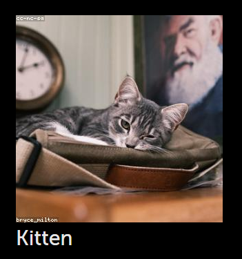

<!--
* Concept: App Scaffolding
* Concept: JSX - syntax and comments
-->

To explore some more interesting features of ES6, React, and Enact, we're going to pivot from our [Hello, Enact!](../../tutorial-hello-enact/) app to a new app: Kitten Browser. In this step, we will setup the module and create the initial App component to lay the foundation for the rest of the guide.

> We'll use the placeholder image site [LoremFlickr](http://loremflickr.com/) to source our images.
> If you're not a fan of kittens, you're welcome to substitute a different keyword in the URLs.  No judgments.

### Directory Structure
```none
+ App
	+ src						<-- All of our source code
		+ App					<-- The App component to be rendered into the DOM
			- App.js
			- package.json
		+ components			<-- Any reusable components for our App
			+ Kitten
				Kitten.js
				Kitten.module.less
				package.json
		+ views					<-- Composite components that make up a distinct view of the app
			Detail.js
			List.js
		- index.js				<-- The entry point for the module
	- package.json				<-- Module meta-data
```
### ./package.json

Let's give our module a name and establish its dependencies.  Edit `package.json` and update the `name` property.

```json
{
	"name": "enact-tutorial-kitten-browser",
	"version": "1.0.0",
	"description": "A general template for an Enact Sandstone application.",
	"author": "",
	"main": "src/index.js",
	"scripts": { [omitted] },
	"license": "UNLICENSED",
	"private": true,	
	"repository": "",
	"enact": {
		"theme": "sandstone"
	},
	"eslintConfig": {
		"extends": "enact"
	},
	"dependencies": { [omitted] }
}
```
### ./src/index.js
```js
import React from 'react';
import {render} from 'react-dom';

import App from './App';

let appElement = (<App />);

// In a browser environment, render instead of exporting
if (typeof window !== 'undefined') {
	render(
		appElement,
		document.getElementById('root') // provided by Enact's HTML template
	);
}

export default appElement;
```
## App

### ./src/App/package.json
```json
{
	"main": "App.js"
}
```
### ./src/App/App.js

At this point, our app looks a lot like Hello, Enact!'s [App.js](../../tutorial-hello-enact/kind#updating-appjs) with a couple small changes. We won't need any custom CSS for our App component so we've removed that `import`. We've also replaced the content with the basic markup for a single photo.
```js
import kind from '@enact/core/kind';
import ThemeDecorator from '@enact/sandstone/ThemeDecorator';
import React from 'react';

const AppBase = kind({
	name: 'App',

	render: function (props) {
		return (
			<div className={props.className}>
				<div>
					{/* For the feline-declined, you can replace the keyword below */}
					
					<div>Kitten</div>
				</div>
			</div>
		);
	}
});

const App = ThemeDecorator(AppBase);

export default App;
export {
	App, 
	AppBase
};
```

### JSX Hints

You might be wondering why the `` tag uses the self-closing syntax (`/>`). This is a requirement imposed by JSX, so whenever you include an element that doesn't have any children, you must either use the self-closing syntax or explicitly close it (`</img>`).

Comments in your code are helpful and JSX is no different. Comments in JSX must be within an expression to be correctly parsed by the plugin.
If you'd like to know more information, see [jsx-in-depth](https://reactjs.org/docs/jsx-in-depth.html).

## Serve the App

With the scaffolding in place, you should be able to fire up the Enact dev server and see
Kitten Browser in action:
```bash
npm run serve
```

> Tell the kids to avert their eyes!

### ESLint Hints

When you run the above command, you might see the compilation warning message below. Let's take a look at what this message means and try to resolve it briefly.
```console
Compiled with warnings.

./src/App/App.js
  Line 13:6:  img elements must have an alt prop, either with meaningful text, or an empty string for decorative images  jsx-a11y/alt-text

Search for the keywords to learn more about each warning.
To ignore, add // eslint-disable-next-line to the line before.
```
The `npm run serve` command (aliased as `enact serve`) will build and host your project on a web server. While building the code, it allows ESLint to perform a static analysis of the source code. ESLint helps you to find syntax errors, anti-patterns, and to write the source code in a consistent code style. See [about ESLint](https://eslint.org/docs/about/) for more information. If you only want to run a static analysis of the code you wrote, use `npm run lint` command (aliased as `enact lint`).

Returning to the warning message, ESLint says img elements should have an `alt` property. That's right. When you use the `` tag, it is recommended to define an `alt` property for accessibility failure to load the image. More info is available on [MDN](https://developer.mozilla.org/en-US/docs/Web/HTML/Element/img). We'll add the `alt` property to the tag as follows. See if it is built successfully.
```js

```

## Conclusion

In this step we've created a basic single App component that shows a single photo. In the Step 2 we'll start to make our app more flexible and composable, as well as dive into another new feature of ES6: `=>` arrow functions.

**Next step: [Kitten Browser: Step 2](../reusable-components/)**
